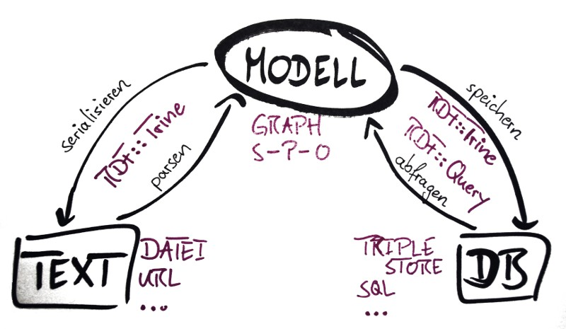

% RDF und Perl
% Thomas Kappler
% 2010-06-08

# Über mich

 

Thomas Kappler

http://jugglingbits.wordpress.com

# Übersicht

  1. RDF
  2. Mit RDF arbeiten
    1. Text
    2. Datenbanken
<!--  4. Weitere Codebeispiele -->

<!--
<table>
<tr> <td>Dieser Vortrag:</td>
     <td>http://github.com/thomas11/perl-rdf-talk</td> </tr>
<tr> <td>Code:</td>
     <td>http://github.com/thomas11/perl-rdf-experiments</td> </tr>
</table>
-->

# Was ist das Problem?

**S**ilos  
**S**kripte  
**S**truktur

\> 50% der Arbeit in der Bioinformatik.

# Semantic Web?

Ontologien, Reasoning, ...

Aber RDF allein ist voellig ausreichend!

# RDF

Generisches Modell für Daten im Web.

# Der RDF-Graph

<table cellspacing="20">
<tr> <td>Dinge beschreiben: </td>
     <td>Subject&mdash;Property&mdash;Object</td>
     <td>.</td> </tr>
<tr class="incremental"> <td></td>
     <td style="text-align: center">**Tripel**</td>
     <td></td> </tr>
<tr> <td colspan="2">&nbsp;</td> </tr>
</table>

  <!--  -->
  <object data="img/graph-einfach.svg" type="image/svg+xml"
  height="250" />

# Der RDF-Graph

<table cellspacing="20">
<tr> <td>Dinge beschreiben: </td>
     <td>Subject&mdash;Property&mdash;Object</td>
     <td>.</td> </tr>
<tr> <td></td>
     <td style="text-align: center">**Tripel**</td>
     <td></td> </tr>
<tr> <td colspan="2">Globale Adressierung mit **URIs**.</td> </tr>
</table>

  <!--  -->
  <object data="img/graph-einfach-urls.svg" type="image/svg+xml"
  height="250" />

<!-- Wenn die URLs auch funktionieren: *Linked (Open) Data* :-) -->

# Linked (Open) Data

<!--  -->

Richard Cyganiak und Anja Jentzsch, CC by-sa

# Linked (Open) Data

Linked Data ⋍ Web of Data ⋍ Semantic Web

"The Semantic Web isn't just about putting data on the web. It is
about making links, so that a person or machine can explore the web of
data." (Tim Berners-Lee,
http://www.w3.org/DesignIssues/LinkedData.html)

Silos öffnen.

# Linked (Open) Data

1. Use URIs as names for things.
2. Use HTTP URIs so that people can look up those names.
3. When someone looks up a URI, provide useful information, using the standards (RDF*, SPARQL)
4. Include links to other URIs. so that they can discover more things.

(http://www.w3.org/DesignIssues/LinkedData.html)

“Linked Data is the Semantic Web done right” (Tim Berners-Lee)

# Was bringt's?

*Spart Arbeit.*

  - Datenmodell durch explizite Semantik.
  - Integration durch globale URLs.

Ergebnis: globales, dezentrales Data Warehouse.

(frei nach Paul Gordon, Biohackathon Mailing List)

Im Idealfall: neue Information *entdecken*.

# Beispiele

Bioinformatik: www.uniprot.org

Open Government: www.data.gov

Noch nicht besonders "Linked"&mdash;die grosse Herausforderung.

# Mit RDF arbeiten

# Serialisierung

Mehrere&mdash;unabhängig vom Graphmodell.

RDF/XML  
Turtle  
N3  
JSON  
Perl-pragmatisch: `as_hashref`

# Serialisierung: RDF/XML

~~~~ {.Xml}
<?xml version='1.0' encoding='UTF-8'?>
<rdf:RDF xmlns="http://purl.uniprot.org/core/"
         xmlns:rdf="http://www.w3.org/1999/02/22-rdf-syntax-ns#">
  <rdf:Description rdf:about=
   "http://purl.uniprot.org/uniprot/P12345">
    <rdf:type rdf:resource=
     "http://purl.uniprot.org/core/Protein" />
    <created>1989-10-01</created>
    <enzyme rdf:resource=
     "http://purl.uniprot.org/enzyme/2.6.1.1" />
  </rdf:Description>
</rdf:RDF>
~~~~

# Serialisierung: Turtle

    @prefix uniprot: <http://purl.uniprot.org/core/> .
    @base <http://purl.uniprot.org/> .

    <uniprot/P12345>
        a               uniprot:Protein ;
        uniprot:created "1989-10-01" ;
        uniprot:enzyme  <enzyme/2.6.1.1> .

# RDF::Trine

**RDF::Trine**: "An RDF Framework for Perl"  
von Gregory Williams.

RDF::Trine::Model  
RDF::Trine::Node  
RDF::Trine::Parser  
RDF::Trine::Serializer  
RDF::Trine::Store  
RDF::Trine...

# Parser und Serialisierer

~~~~ {.Perl}
use RDF::Trine;
# use RDF::Trine::Store etc.;

my $base_uri = 'http://purl.uniprot.org/core';
my $store    = RDF::Trine::Store::Memory->new;
my $model    = RDF::Trine::Model->new($store);
# my $model  = RDF::Trine::Model->temporary_model;
 
my $rdf = read_file($file);

my $in_format  = 'rdfxml';
my $out_format = 'turtle';
~~~~

# Parser und Serialisierer

~~~~ {.Perl}
my $parser = RDF::Trine::Parser->new($in_format);
$parser->parse_into_model($base_uri,
                          $rdf, $model);

say "Read " . $model->size . " statements.";
~~~~

# Parser und Serialisierer

~~~~ {.Perl}
my $out = RDF::Trine::Serializer->new($out_format);
print $out->serialize_model_to_string($model);
~~~~

# Parser und Serialisierer

    $ perl trine-roundtrip.pl -o turtle p12345.rdf
    Read 3 statements.
    <http://purl.uniprot.org/uniprot/P12345>
        <http://purl.uniprot.org/core/created>
            "1989-10-01" ;
        <http://purl.uniprot.org/core/enzyme>
            <http://purl.uniprot.org/enzyme/2.6.1.1> ;
        a <http://purl.uniprot.org/core/Protein> .

# as_hashref

~~~~ {.Perl}
my $model_h = $model->as_hashref;
print Dumper(
    $model_h->{$uniprot_uri.'/uniprot/P12345'});
~~~~

# as_hashref

~~~~
$VAR1 = { 'http://purl.uniprot.org/core/created' => [
            {
              'value' => '1989-10-01',
              'type' => 'literal'
            }
          ],
          'http://www.w3.org/1999/02/22-rdf-syntax-ns#type' => [
            {
              'value' => 'http://purl.uniprot.org/core/Protein',
              'type' => 'uri'
            }
          ],
~~~~

# Mehr als nur Dateien

Datenbanken
    <ul>
      <li>**Triple Stores**</li>
        <ul> <li>4store</li> <li>Virtuoso</li> <li>...</li> </ul>
        <li>Alles, was einen Graph speichern kann.</li>
        <ul> <li>In-Memory</li> <li>SQL</li> <li>...</li></ul>
    </ul>

Abfragesprache: **SPARQL**

# SPARQL

  <object data="img/graph-einfach-sparql.svg" type="image/svg+xml"
    height="250" />

**Graph Patterns**: Tripel mit Variablen.

Wann wurde P12345 angelegt?

    select ?date
    where {
      <uniprot/P12345>
      uniprot:created
      ?date
    }

# RDF::Query

**RDF::Query**: "An RDF query implementation of SPARQL/RDQL in Perl for use with RDF::Trine." 

 
von... Gregory Williams.

# RDF::Query

~~~~ {.Perl}
my $query = new RDF::Query ( $sparql );
my result = $query->execute( $model );

while (my $row = $result->next) {
    print $row->{ date }->as_string;
}
~~~~

# RDF::Query

Kostprobe programmatisch:

~~~~ {.Perl}
my $object = new_var($prop);
push @patterns,
     new_triple($subject, $UNIPROT->$prop, $object);
my $bgp = new
  RDF::Query::Algebra::BasicGraphPattern(@patterns);
# ...
~~~~

# Integration

<table cellspacing="30">
  <tr> <td>Perl Code</td>    <td>Graph <-> Hash</td>    <td>Trine::Model</td> </tr>
  <tr> <td>Datenbank</td>    <td>Tripel relational</td> <td>Trine::Store</td> </tr>
  <tr> <td>Webanwendung</td> <td>JSON</td>              <td>Trine::{Serialiser,Parser}</td> </tr>
  <tr> <td></td>             <td>RDF bereitstellen</td> <td>Trine::{Serialiser,Parser}</td> </tr>
</table>

# Zusammenfassung

1. RDF-Graph: Tripel aus Subjekt-Prädikat-Objekt, mit URIs
<!-- 2. URIs und Literale; Linked Open Data -->
2. Serialisierung: RDF/XML, Turtle
3. RDF::Trine: Modell, Parser, Serialisierer
4. RDF::Query: SPARQL
5. Integration: MySQL, JSON, Hashes, RDFa

# Zusammenfassung

RDF mit Perl: voll unterstützt.

In Arbeit: Catalyst-Modell, RDF::LinkedData, XS.

**The Perl RDF Project**: http://www.perlrdf.org

<table>
<tr> <td>Dieser Vortrag:</td>
     <td>http://github.com/thomas11/perl-rdf-talk</td> </tr>
<tr> <td>Code:</td>
     <td>http://github.com/thomas11/perl-rdf-experiments</td> </tr>
</table>

# Danke an

**Greg Williams**, Kjetil Kjernsmo, Toby Inkster, et al.:  
*The Perl RDF Project*

Toshiaki Katayama, DBCLS, CBRC: Biohackathon Tokyo

<table>
<tr> <td>Dieser Vortrag:</td>
     <td>http://github.com/thomas11/perl-rdf-talk</td> </tr>
<tr> <td>Code:</td>
     <td>http://github.com/thomas11/perl-rdf-experiments</td> </tr>
</table>

# Mehr Code: Übersicht

1. RDF selbst gemacht: programmatisch generieren
2. SPARQL Queries programmatisch generieren

http://github.com/thomas11/perl-rdf-experiments

# RDF selbst gemacht: Übersicht

1. Namespaces
2. Ressourcen
3. Tripel
4. Graph

http://github.com/thomas11/perl-rdf-experiments/  
-> make_a_graph.pl

# RDF selbst gemacht, 1: Namespaces

~~~~ {.Perl}
my $BASE   = 'http://purl.uniprot.org/';

my %namespaces = ();
sub namespace {
    my ($section) = @_;
    my $ns = $namespaces{$section};
    if (not $ns) {
        my $url = $BASE . $section . '/';
        $ns = RDF::Trine::Namespace->new($url);
        $namespaces{$section} = $ns;
    }
    return $ns;
}

my $ONTOLOGY = namespace('core');
~~~~

# RDF selbst gemacht, 2: Resources

~~~~ {.Perl}
sub new_resource {
    my ($name, $section) = @_;
    return RDF::Trine::Node::Resource->new(
        $name, namespace($section) );
}

sub new_literal {
    my ($str) = @_;
    return RDF::Trine::Node::Literal->new( $str );
}
~~~~

# RDF selbst gemacht, 3: Statements

~~~~ {.Perl}
sub new_s {
    my ($s, $p, $o) = @_;
    return RDF::Trine::Statement->new($s, $p, $o);
}

my @stmts = (
  new_s($p12345, $ONTOLOGY->created,
        new_literal('1989-10-01')),
  new_s($p12345, $ONTOLOGY->enzyme,
        new_resource('2.6.1.1', 'enzyme')),
  new_s($p12345, $rdf->type,
        $ONTOLOGY->Protein)
);
~~~~

# RDF selbst gemacht, 4: Model

~~~~ {.Perl}
my $model = RDF::Trine::Model->temporary_model;
$model->add_statement($_) for @stmts;

my $serializer =
  RDF::Trine::Serializer::Turtle->new;
print $serializer->
  serialize_model_to_string($model), "\n";
~~~~

# RDF selbst gemacht, Ergebnis

    $ perl make_a_graph.pl
    <http://purl.uniprot.org/uniprot/P12345>
        <http://purl.uniprot.org/core/created>
            "1989-10-01" ;
	<http://purl.uniprot.org/core/enzyme>
            <http://purl.uniprot.org/enzyme/2.6.1.1> ;
	a <http://purl.uniprot.org/core/Protein> .

<!--
# SPARQL programmatisch

1. Basic Graph Pattern
2. Group Graph Pattern
3. Project
4. Query

http://github.com/thomas11/perl-rdf-experiments/  
-> make_a_sparql_query.pl

# SPARQL programmatisch: plumbing

~~~~ {.Perl}
my $BASE    = 'http://purl.uniprot.org/';
my $UNIPROT = RDF::Trine::Namespace->new('http://purl.uniprot.org/core/');

my $store   = RDF::Trine::Store::Memory->new;
my $model   = RDF::Trine::Model->new($store);

my $file = shift;
my $rdf  = read_file($file);

my $parser = RDF::Trine::Parser::Turtle->new;
$parser->parse_into_model( $BASE, $rdf, $model );
~~~~

# SPARQL programmatisch: Graph Patterns

~~~~ {.Perl}
sub new_var {
  my ($var) = @_;
  return scalar
      RDF::Query::Node::Variable->new($var);
}

sub new_triple {
  my ($s, $p, $o) = @_;
  return scalar
      new RDF::Query::Algebra::Triple($s, $p, $o)
}
~~~~

# SPARQL programmatisch: Project 

~~~~ {.Perl}
sub new_basic_project {
    my ($patterns, $result_prop) = @_;
    my $bgp = new
      RDF::Query::Algebra::BasicGraphPattern(
                  @$patterns);
    my $ggp = new
      RDF::Query::Algebra::GroupGraphPattern($bgp);
    return scalar RDF::Query::Algebra::Project->new(
                      $ggp, [new_var($result_prop)]);
}
~~~~

# SPARQL programmatisch: Project

~~~~ {.Perl}
my $p12345  = RDF::Trine::Node::Resource->new(
                  $BASE.'uniprot/P12345' );
my $result_prop = 'date';

my $patterns = [ new_triple($p12345,
                            $UNIPROT->created,
                            new_var($result_prop)) ];
my $project  = new_basic_project($patterns,
                                 $result_prop);
~~~~

# SPARQL programmatisch: Query senden

~~~~ {.Perl}
# Manual SELECT will soon be unnecessary.
my $sparql = "SELECT " . $project->as_sparql;
print $sparql, "\n\n";

my $results = new RDF::Query($sparql)
                  ->execute( $model );
while (my $triple = $results->next) {
    my $result = $triple->{ $result_prop };
    print "-> ", $result, "\n";
}
~~~~

# SPARQL programmatisch: Ergebnis

    $ perl make_a_sparql_query.pl testdata/p12345-abbr.tt 
    SELECT * WHERE {
        <http://purl.uniprot.org/uniprot/P12345>
            <http://purl.uniprot.org/core/created> ?date .
    }

    -> "1989-10-01"
-->    
